# Simple DB

[](https://marketplace.visualstudio.com/items?itemName=apertacodex.simple-db)
[](https://marketplace.visualstudio.com/items?itemName=apertacodex.simple-db)
[](https://marketplace.visualstudio.com/items?itemName=apertacodex.simple-db)
[](https://github.com/ApertaCodex/simple-db/blob/master/LICENSE)

A powerful VS Code extension for viewing, filtering, and exploring SQLite and MongoDB databases with an intuitive interface and smart filtering capabilities.

## ✨ Features

- **SQLite Support**: Connect to SQLite database files (.db, .sqlite, .sqlite3)
- **MongoDB Support**: Connect to MongoDB instances using connection strings
- **Smart Filters**:
  - **Numbers**: Use operators like `>100`, `<50`, `>=10`, `<=20`, `10-20` (range)
  - **Dates**: Filter with `>2024-01-01`, `<2024-12-31`, `2024-01-01 to 2024-12-31` (range)
  - **Text**: Simple substring matching
- **Interactive Data Grid**:
  - Click column headers to sort
  - Per-column filtering with search icon
  - Pagination for large datasets
  - Syntax-highlighted values (numbers, strings, booleans, null)
- **Tree View Explorer**: Browse databases and their tables/collections in the sidebar
- **Persistent Connections**: Automatically save and restore database connections
- **Auto-Open SQLite Files**: Automatically detect and open .db files when clicked

## 📸 Screenshots

### Database Explorer
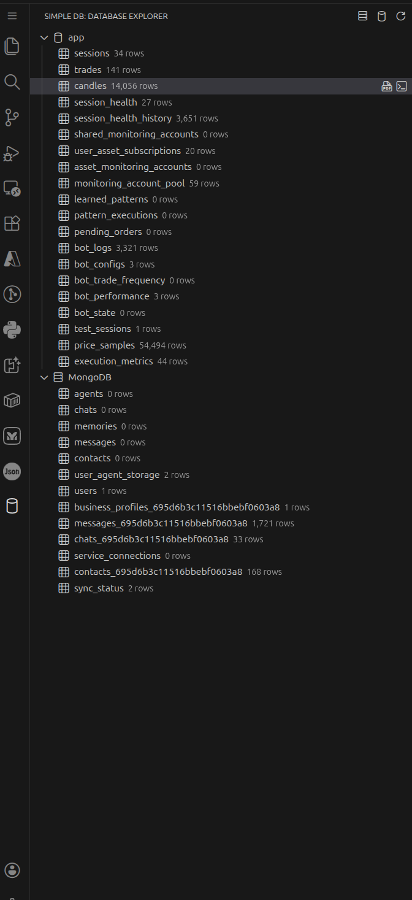
*Database Explorer sidebar with connections and table tree view*

### Data Grid and Filtering
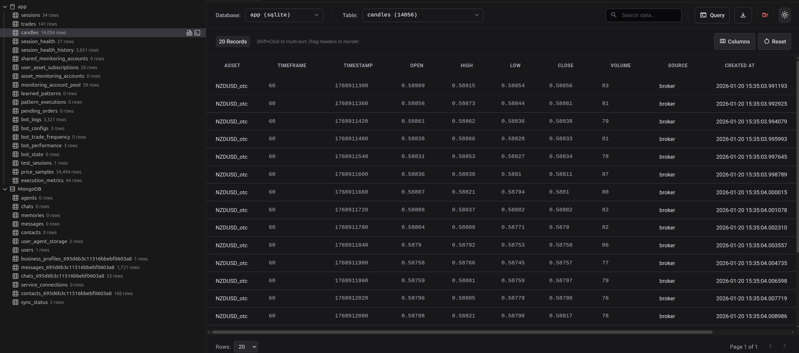
*Interactive data grid with sorting and filtering*

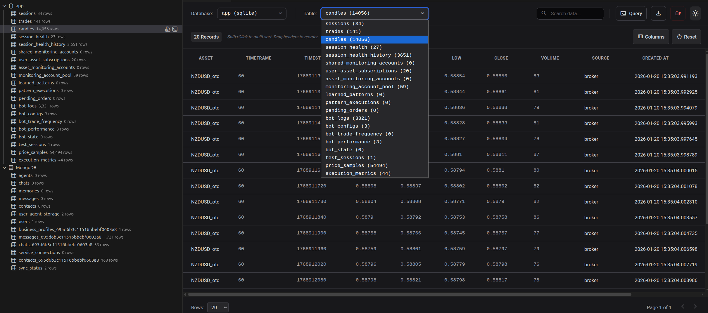
*Smart filtering for number columns with operators*

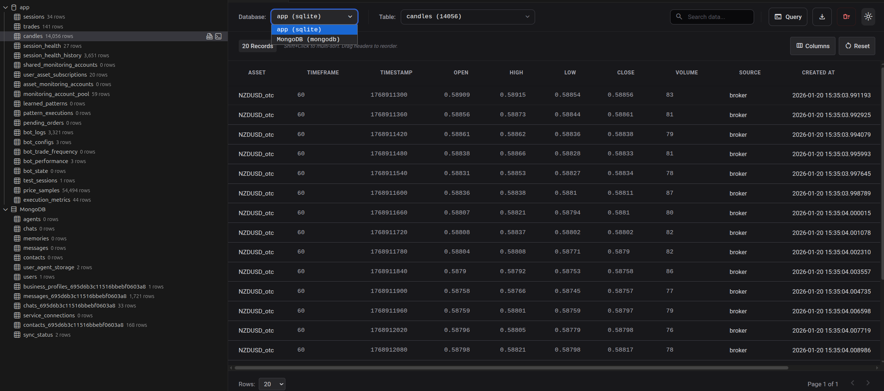
*Date filtering with ranges and comparison operators*

### Query Features
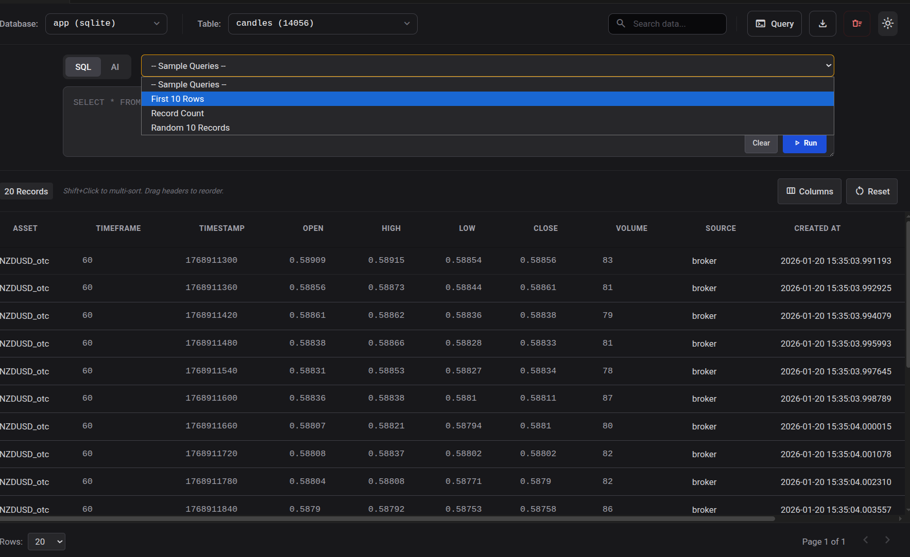
*Predefined sample queries for quick database exploration*

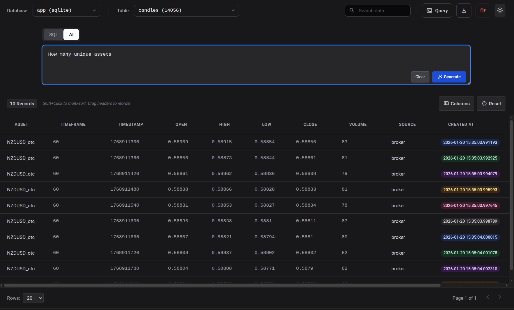
*AI-powered natural language query interface*

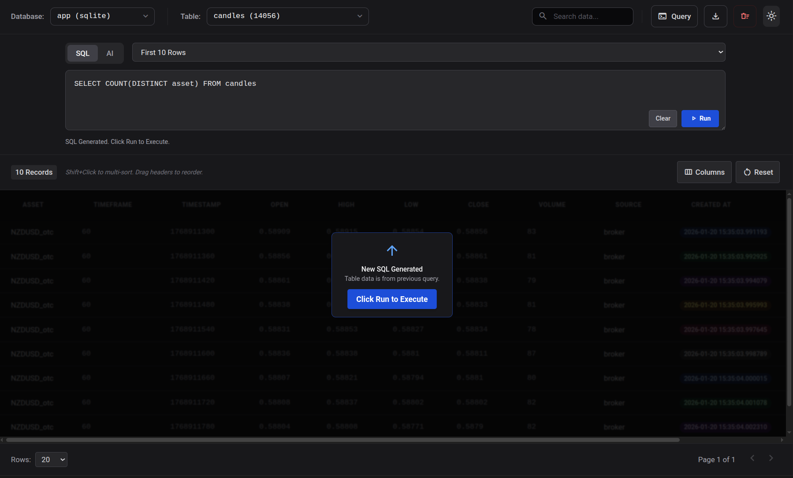
*SQL query editor with execution interface*

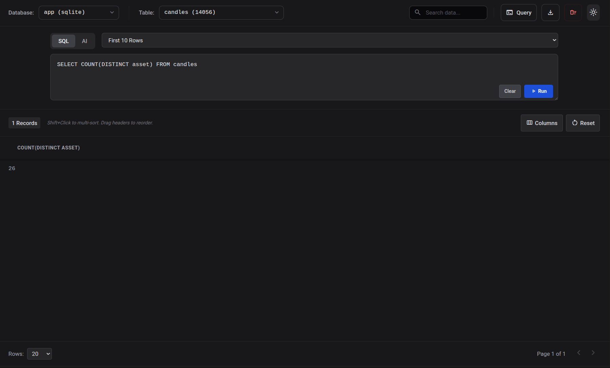
*Query results displaying aggregated data*

### Advanced Filtering
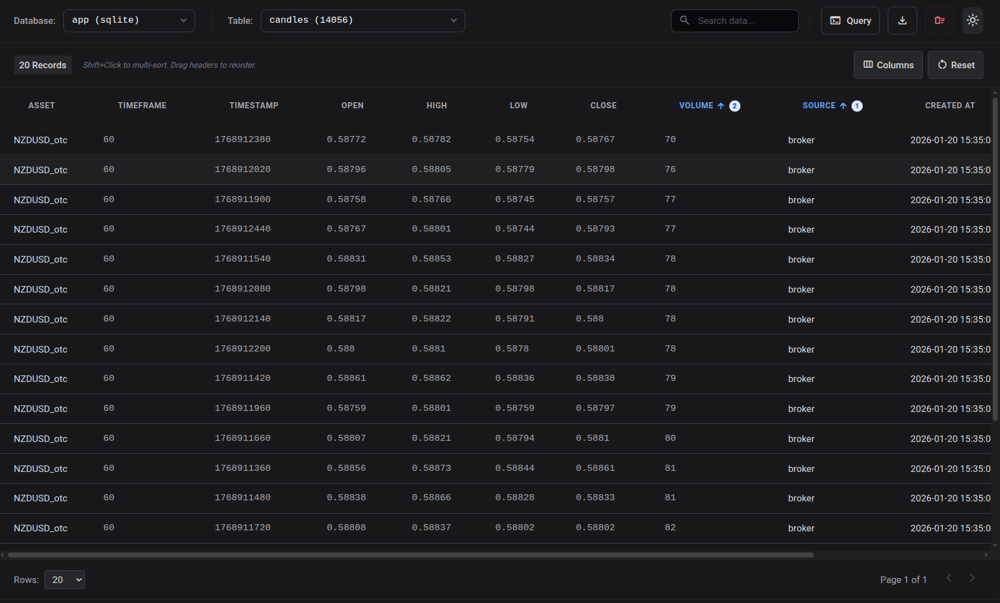
*Column-specific filter menu*

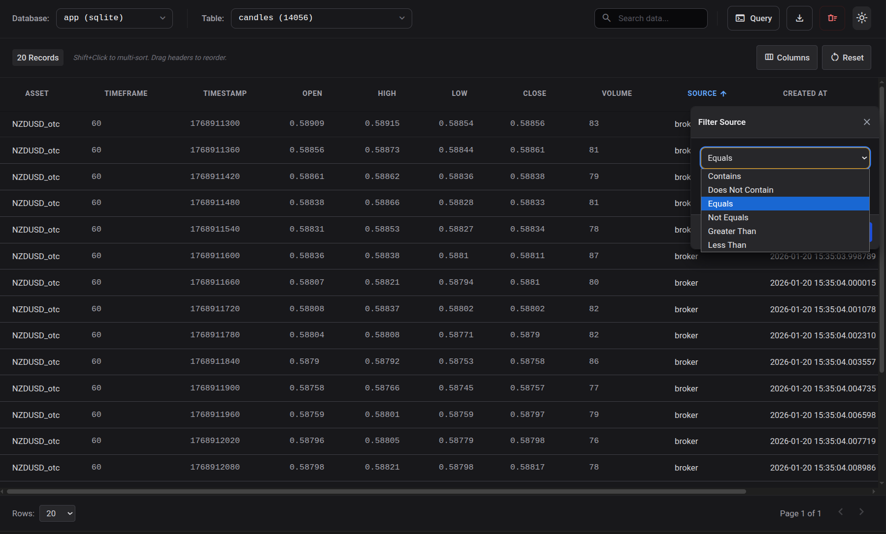
*Available filter types and options*

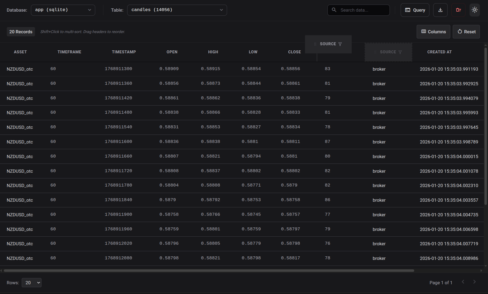
*Multi-column sorting capabilities*

## 🚀 Installation

Install from the VS Code Marketplace:
```
ext install apertacodex.simple-db
```

Or search for "Simple DB" in the Extensions view (Ctrl+Shift+X).

## 📖 Usage

### Adding Database Connections

1. Open the **Database Explorer** in the VS Code sidebar (database icon)
2. Click the **database icon** (➕) to add a SQLite database
3. Click the **server icon** to add a MongoDB connection
4. Or simply **open any .db file** - it will be added automatically!

### Viewing and Filtering Data

1. **Expand** a database connection in the explorer
2. **Click** on a table/collection to view its data
3. **Click the filter icon** (🔍) on any column header to filter:
   - **For numbers**: Type `>100`, `<50`, `>=10`, `10-20`, etc.
   - **For dates**: Type `>2024-01-01`, `2024-01-01 to 2024-12-31`, etc.
   - **For text**: Type any substring to search
4. **Press Enter** or click the **🔍 button** to apply the filter
5. **Click column headers** to sort ascending/descending
6. Use **pagination controls** at the bottom to navigate large datasets

### Filter Examples

**Number Filters:**
- `>100` - Greater than 100
- `<50` - Less than 50
- `>=10` - Greater than or equal to 10
- `10-20` - Between 10 and 20 (range)
- `!=5` - Not equal to 5

**Date Filters:**
- `>2024-01-01` - After January 1, 2024
- `<2024-12-31` - Before December 31, 2024
- `2024-01-01 to 2024-12-31` - Date range
- `2024-06` - Contains "2024-06" (partial match)

## Configuration

The extension stores database connections in VS Code settings under `simpleDB.connections`.

## Dependencies

- **sqlite3**: SQLite database driver
- **mongoose**: MongoDB object modeling tool

## Development

- `npm run compile`: Compile TypeScript to JavaScript
- `npm run watch`: Watch for changes and recompile automatically

## 📝 Changelog

### [0.0.164] - 2024-12-24

**Added:**
- Database icon for marketplace listing
- 3 professional screenshots showcasing features
- Enhanced README with badges and better documentation
- Categories and keywords for improved discoverability

**Improved:**
- Smart filter UI with search button icon (🔍)
- Date filters now support ranges and comparison operators
- Number filters support multiple operator types
- Filter help text shows supported operators

### [0.0.163] - 2024-12-24

**Added:**
- Smart filtering system with operator support
- Number filters: `>`, `<`, `>=`, `<=`, `=`, `!=`, ranges
- Date filters: comparison operators and date ranges
- Filter submission via Enter key or button click
- Per-column filter inputs with type detection

**Improved:**
- Filter UI with dedicated input fields per column
- Better filter user experience with visual feedback

### [0.0.1] - Initial Release

**Added:**
- SQLite database support (.db, .sqlite, .sqlite3)
- MongoDB connection support
- Interactive data grid with pagination
- Column sorting (ascending/descending)
- Global search across all columns
- Tree view explorer for databases and tables
- Persistent connection storage
- Auto-open SQLite files on click
- Syntax highlighting for different data types

## 📄 License

This project is licensed under the MIT License - see the [LICENSE](LICENSE) file for details.

## 🤝 Contributing

Contributions are welcome! Feel free to submit issues and pull requests on [GitHub](https://github.com/ApertaCodex/simple-db).

## 💬 Support

If you encounter any issues or have suggestions, please [open an issue](https://github.com/ApertaCodex/simple-db/issues) on GitHub.
